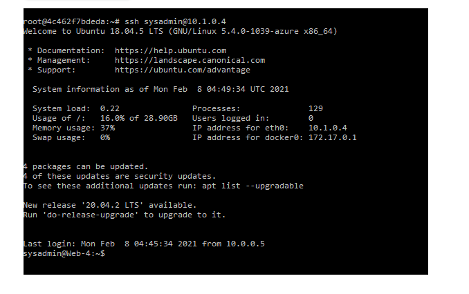
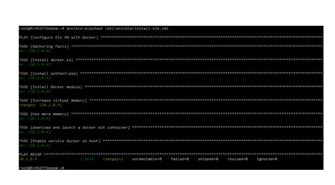

## ELK Stack Project

### Red Team Resource Group Overview

Diagram below shows full deployment of the RedTeam Resource Group with all the Virtual Artifacts used.

### Unit Objectives
- Deploy containers using Ansible and Docker.

- Deploy Filebeat using Ansible.

- Deploy the ELK stack on a server.
![ELK Stack](Images/ELK_Docker.PNG
- Diagram networks and creating a README.

- Craft documentation and interview responses to effectively communicate your achievements. 

### Lab Environment
Personal Azure Environment was used to deply all VM's.

### New VM in Cenrtral Location:

- VM for the ELK server had 8GB of memory for the ELK container to run properly. 
- The VM was deploed in Central Region.
- Create another vNet in another region and attempt to create the ELK sever in that region.

### Security+ Domains

This unit covers portions of the following domains on the Security+ exam:

    
 Click here to view Security+ Domains that apply to this project. 
 
  

- Indicators of compromise
- Types of attacks
- Network components
- Secure network architecture concepts
- Common security issues
- Secure protocols
- Incident response procedures

### Additional Reading and Resources

 

 Click here to view additional reading materials and resources. 

 

#### Day 1

- [Elastic: The Elastic Stack](https://www.elastic.co/elastic-stack).
- [Elastic: Filebeat](https://www.elastic.co/beats/filebeat).
- [ELK Docker Documentation](https://elk-docker.readthedocs.io/).
- [Microsoft Azure: Global vNet Peering](https://azure.microsoft.com/en-ca/blog/global-vnet-peering-now-generally-available/)
- [Microsoft Docs: How to open a support ticket](https://docs.microsoft.com/en-us/azure/azure-portal/supportability/how-to-create-azure-support-request)
- [Peachpit.com: Split-Half Search](https://www.peachpit.com/articles/article.aspx?p=420908&seqNum=3)

#### Day 2:

- [Elastic: Filebeat Container Documentation](https://www.elastic.co/beats/filebeat)
- [Phoenixnap.com: Docker Commands Cheat Sheet](https://phoenixnap.com/kb/list-of-docker-commands-cheat-sheet)
- [Boot Camp Resource: Docker and Ansible Cloud Week Cheat Sheet](../12-Cloud-Security/CheatSheet.md)
- [Ansible: Roles Playbook Reuse Roles](https://docs.ansible.com/ansible/latest/user_guide/playbooks_reuse_roles.html)

#### Day 3

- [Elastic: Getting Started with the Elastic Stack](https://www.elastic.co/guide/en/elastic-stack-get-started/current/get-started-elastic-stack.html)

---

---

© 2020 Trilogy Education Services, a 2U, Inc. brand. All Rights Reserved.
